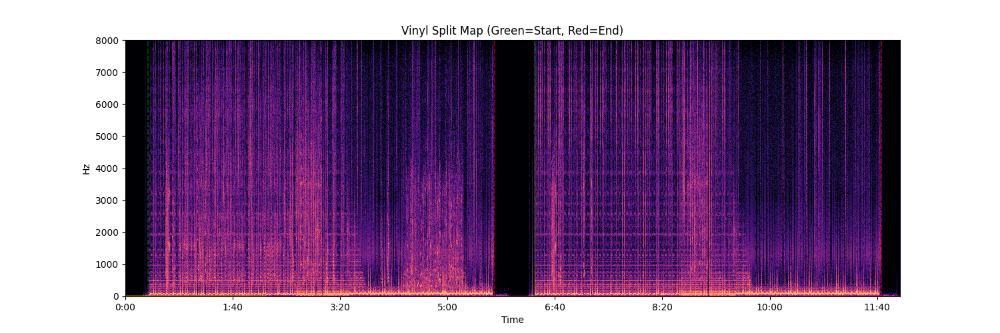

I digitized my vinyl collection to get ready for life as a digital nomad. But I ended up with hundreds of master copies like Recording_20220203223743.dsf. So I wrote a Python script that detects the tracks in your rip of a side of a record.

And outputs a map. It's a spectrogram. The pink flames are decibels. Overlaid over that, dotted green lines show track start times. Dotted red lines show track end times.



I finally unearthed a project to learn about ffmpeg, librosa, and how to analyze music in Python.

## Dependencies

You'll need the FFmpeg library and the following Python libraries:

- FFmpeg
- Librosa
- Numpy
- Matplotlib

### Install FFmpeg

You install [FFMpeg](https://ffmpeg.org/download.html) on Linux, Windows, and macOS. On Linux, you can use your package manager. For example, on Ubuntu, install with

  sudo apt install fmpeg

### Install the Python libraries

Install the Python libraries with `pip`. To install only for your user:

    pip install -u librosa numpy matplotlib

On Ubuntu 24.04, install the Python libraries in a virtual environment:

``` bash
# Create a folder for your project
mkdir my_audio_project && cd my_audio_project

# Create the virtual environment
python3 -m venv venv

# Activate it
source venv/bin/activate

pip install librosa numpy matplotlib
```

## Analyze your music with librosa

Ever wanted to create a 120 BPM playlist? You can retrieve information like beat and tempo from your music with librosa. 

The librosa Python library analyzes audio as music. Or, audio as silence.

The vinylsplit.py script identifies tracks that are separated by silence. Silence might be gaps between tracks. Or it might be quiet bells. The script gives you knobs for slicing and other ways to fine-tune how tracks are detected. The knobs are the parameters of `ffmpeg` and `librosa`.

## Run on your master vinyl

You can run vinylsplit.py on your master vinyl file. Don't worry! The script doesn't modify the input file.

Specify `MASTER_VINYL` and `OUTPUT_DIR` at the top of the file, then run the script.

\$ python3 vinylsplit.py

--- Analyzing Recording_20220203223743.dsf ---
Average volume: -8.39 dB
Quietest point: -27.01 dB
Filtered 72 raw segments down to 8 real tracks.
Detected 8 potential tracks.
Writing ./split_tracks/Recording_20220203223743/track_01.flac...

## Tune track detection

Use the knobs and spectrographic map to complete two basic steps.

### Extract the right number of tracks

The script's probably not going to output the right number of tracks at first.

**Is there only one track?** 
Break up the wall of noise.

**Are there hundreds of tiny tracks?**
Glue them together.

The tracks shown in the map are made up of glued-together segments. Librosa doesn't output silence, so the script glues together all the music separated by pauses -- or quiet bells, if the threshold is too high.

Other than the threshold for silence, there are a few other knobs. The knobs are the parameters of the Librosa and ffmpeg commands.

### Map tracks onto the spectrogram

Once you've got the right number of tracks, use the spectrogram. Align the green and red lines with the gaps.

Try the following options in order:

1.  **top_db**

    Specify the loudest peak.

    Set the `top_db` parameter in the call to `librosa.effects.split`.

    ``` python
    intervals = librosa.effects.split(
        audio_data, top_db=20, frame_length=8192, hop_length=2048)
    ```

    `top_db` is used to define the threshold for what counts as silence relative to the loudest peak.

    - Increase (e.g., 30) for clean vinyl. The scan expects the gaps to be very quiet.
    - Decrease (e.g., 22) for noisy/hissing vinyl. The scan allows for louder hiss in the gaps.

    To help you pick `top_db`, the script prints the average volume and quietest point, the noise floor.

    You need to pick a `top_db` that's less sensitive than the noise floor. For example, if the noise floor is -29.5, try setting `top_db` to 20 or 22. This says: "If it's 22dB quieter than the loudest part, it's a gap."

2.  **duration_sec**

    Specify the minimum length of a track to keep it from being deleted by the script.

    - Increase (e.g., 90) for long-form albums (jazz, psych-funk) or to ignore hundreds of tiny false tracks caused by pops.
    - Decrease (e.g., 45) if the album has short interludes or 1-minute songs.

    Set `duration_sec` in the `for` loop that combines the segments, or intervals, into the real tracks.

    ``` python
    valid_tracks = []
    for start_sample, end_sample in intervals:
        duration_sec = (end_sample - start_sample) / 16000
        if duration_sec > 45:  # Adjust to 60 if you have short interludes
            valid_tracks.append((start_sample, end_sample))
    ```

3.  **frame_length**

    Specify how much audio Librosa's `scan` and `split` functions listen to at one time. The `scan` function detects the noise floor. The `split` function outputs segments separated by gaps in the music.

    - Increase (e.g., 16384) to smooth out crackles and pops so they don't look like music to Librosa.
    - Decrease (e.g., 2048) if the gaps between songs are very short, like less than a second.

4.  **hop_length**

    Specify how often the `scan` and `split` functions check the volume.

    - Increase: Faster, but less precise on the exact start/end second.
    - Decrease: More precise, but at the cost of more CPU.

5.  **lowpass**
    You can use ffmpeg's `lowpass` parameter to get more reliable silence detection on dusty records.

    Dusty old records have hiss, not pops or crackles. A lowpass filter blurs that high-frequency hiss.

    In the spectrogram, the lowpass filter fades the purple haze in the gaps. To see the gaps through the hiss, you can add the lowpass filter when you create the audio that's passed to Librosa for analysis.

    ``` python
    print(f"--- Analyzing {INPUT_DSF} ---")
    cmd = ['ffmpeg', '-i', INPUT_DSF, '-f', 'wav', 
          '-af', 'lowpass=12000',
          '-ar', '16000', '-ac', '1', '-']
    proc = subprocess.Popen(cmd, stdout=subprocess.PIPE,
                            stderr=subprocess.PIPE)
    stdout, _ = proc.communicate()

    audio_data, _ = librosa.load(io.BytesIO(stdout), sr=16000)
    ```

6.  sample rate
    Try analyzing at a higher sample rate to give the previous options more granularity. The master audio file is downsampled for faster analysis.

<!-- -->

  `ffmpeg` converts the master audio file to a downsampled FLAC, then pipes the FLAC to `librosa.load`. Be sure to set sample rates that match from `ffmpeg` to `load`. The script downsamples to 16 kHz.

``` python
  # Downsample and pipe to librosa
  print(f"--- Analyzing { MASTER_VINYL} ---")
  cmd = ['ffmpeg', '-i',  MASTER_VINYL, '-f',
         'wav', '-ar', '16000', '-ac', '1', '-']
  proc = subprocess.Popen(cmd, stdout=subprocess.PIPE,
                          stderr=subprocess.PIPE)
  stdout, _ = proc.communicate()

  audio_data, _ = librosa.load(io.BytesIO(stdout), sr=16000)
```

## Helper commands

Use `ffprobe` to Check the lengths of the output tracks. `ffprobe` should be installed with ffmpeg.

``` bash
for f in ./split_tracks/*.flac; do echo -n "$f: "; ffprobe -i "$f" 2>&1 | grep "Duration" | cut -d ' ' -f 4 | sed s/,//; done

Clean metadata in your files, so beets doesn't get confused.

```bash
metaflac --remove-all-tags *.flac
```

You'll need to install the metaflac package.

## Troubleshooting

- The lengths of the first and last tracks are way off Discogs or Bandcamp. There's silence stuck on the beginning and end. But the split map looks OK.

Allow the intervals that Librosa.split outputs to be shorter, so you capture only silence in a shorter segment. Try adjusting `duration_sec` to decrease the minimum length of a segment.
